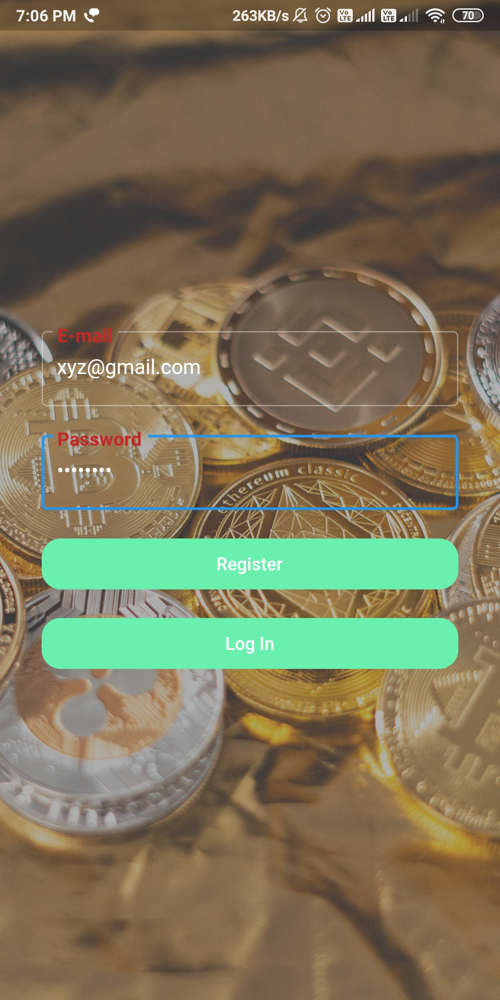
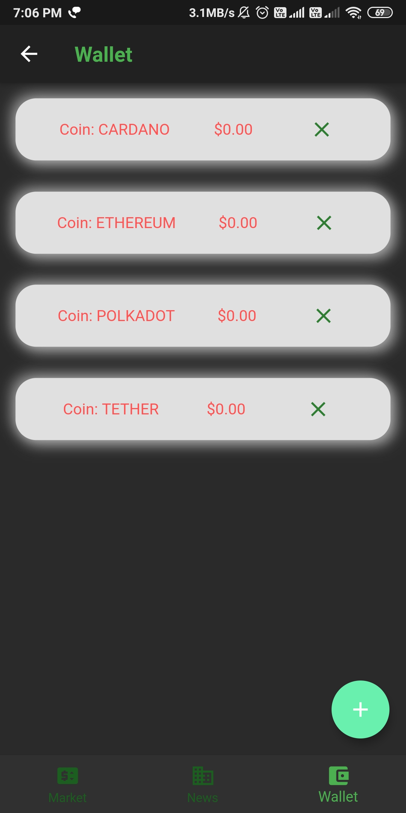

# Crypto_app
 It is all in one app for price tracking, news and maintaining your wallet.
 App Made using latest Technologies like Flutter, Firebase, and Rest Api. 

#  Key Points
# 1)Firebase Authentication.
# 2)Wallet To Maintain Your Cryptocurrency Holdings using Firebase.
# 3)Price Tracker of all the Crypto currencies using API.
# 4)Latest News of Coin Market using API.    

**Screenshots**

 "  " 

 "    "

# Crypto-App
